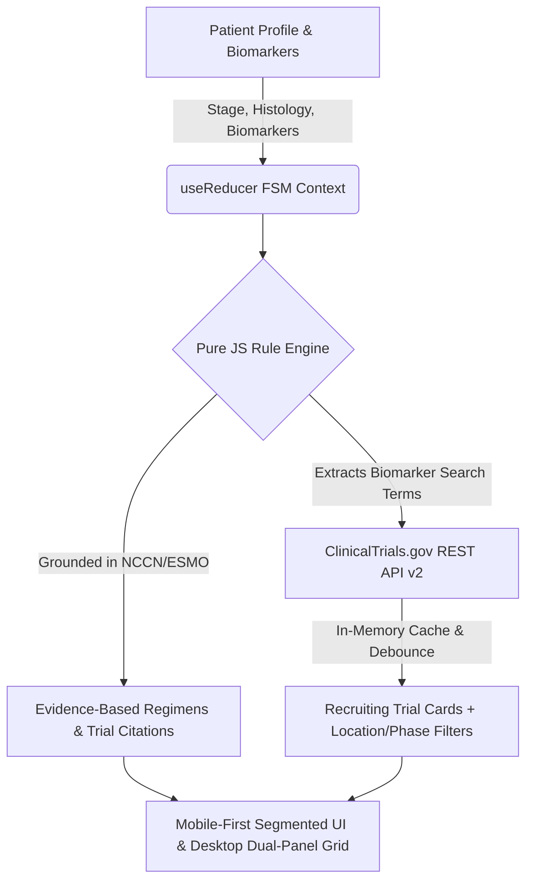

# OncoNavigate & TrialMatch 🧬❤️

[](https://onconavigate.vercel.app)
[](https://github.com/realrezi/onconavigate/releases)
[](LICENSE)
[](https://react.dev)
[](https://vitejs.dev)
[](src/engine/pathwayRules.test.js)

> **Evidence-Based Oncology Clinical Decision Support, Mobile View Switcher & Real-Time Trial Matcher**  
> Developed by **Dr. Ahmadreza Shirdel, MD** (Medical Doctor & Computational Researcher)  
> Access Live Public Application: **[https://onconavigate.vercel.app](https://onconavigate.vercel.app)**

---

## 📖 Overview

**OncoNavigate & TrialMatch** is an open-source, mobile-responsive web application designed to support oncologists, medical researchers, patients, and healthcare teams. 

It synthesizes complex clinical practice guidelines (**NCCN** and **ESMO**) into interactive, deterministic decision pathways across **8 major cancer domains**, queries **ClinicalTrials.gov API v2** in real-time for active recruiting clinical studies, and provides a comforting **Care & Clinical Hub** equipped with bedside calculators, international unit converters, and plain-language patient care guides.



---

## 📱 Native Mobile Phone UX (Android & iOS)

Designed with a **mobile-first architecture** to deliver a native app experience on smartphones:

* **Segmented Mobile View Switcher**: On mobile screens ($\le 768\text{px}$), an intuitive view manager toggles between `[ 📝 1. Patient Profile ]` and `[ ✨ 2. Pathways & Trials ]`, eliminating long-page scrolling.
* **Auto-Switch Selection**: Selecting a cancer domain and stage automatically transitions to the results view.
* **Auto-Zoom Glitch Prevention**: All inputs enforce a `16px` font-size on mobile viewports to prevent Chrome/Safari from forcibly zooming in on focus.
* **Touch-Friendly Controls**: 48px minimum touch targets across all buttons, chips, and stepper controls.

---

## 📏 International Unit Measurement System

Supports seamless switching between **US Conventional** and **European / Global SI Metric** standards:

| Parameter | Supported Units | Auto-Conversion Formula |
| :--- | :--- | :--- |
| **Body Weight** | `kg` (Metric) $\leftrightarrow$ `lbs` (US) | $1 \text{ kg} = 2.20462 \text{ lbs}$ |
| **Height** | `cm` (Metric) $\leftrightarrow$ `inches` (US) | $1 \text{ inch} = 2.54 \text{ cm}$ |
| **Serum Creatinine** | `mg/dL` (US) $\leftrightarrow$ `μmol/L` (SI Metric) | $1 \text{ mg/dL} = 88.4 \text{ μmol/L}$ |
| **ANC / ALC Cell Counts** | `x10⁹/L` (SI Metric) $\leftrightarrow$ `/μL` (US) | $1 \times 10^9/\text{L} = 1000 /\text{μL}$ |
| **PSA Level** | `ng/mL` $\leftrightarrow$ `μg/L` (SI Metric) | $1 \text{ ng/mL} = 1 \text{ μg/L}$ |

---

## 🔬 Evidence-Based Clinical Pathways (8 Cancer Domains)

The clinical decision engine synthesizes landmark Phase 3 randomized controlled trials (RCTs) into actionable treatment trees:

| Cancer Domain | Primary Clinical Scenarios | Landmark Phase 3 Evidence & Guideline Citations |
| :--- | :--- | :--- |
| **Prostate Cancer** | mHSPC & mCRPC (HRR, PSMA) | **ARASENS** (ADT+Darolutamide+Docetaxel), **VISION** (177Lu-PSMA-617), **PROfound** (Olaparib), **CARD** (Cabazitaxel) |
| **Esophageal Cancer** | ESCC & EAC / GEJ (HER2, CPS) | **CHECKMATE-648** (Nivolumab+Chemo), **KEYNOTE-590** (Pembrolizumab CPS≥10), **KEYNOTE-811** (Trastuzumab+Pembro HER2+) |
| **Gastric / GEJ Cancer** | HER2+, CLDN18.2+, CPS ≥5 | **SPOTLIGHT & GLOW** (Zolbetuximab+mFOLFOX6), **KEYNOTE-811**, **CHECKMATE-649** (Nivolumab+Chemo) |
| **Colorectal Cancer** | MSI-H, BRAF V600E, RAS Sidedness | **KEYNOTE-177** (1L Pembrolizumab), **BEACON** (Encorafenib+Cetuximab), **PARADIGM** (Left vs. Right Sidedness Anti-EGFR) |
| **NSCLC (Lung)** | EGFR, ALK, KRAS G12C, PD-L1 TPS | **FLAURA & FLAURA2** (Osimertinib ± Chemo), **CROWN** (Lorlatinib), **KEYNOTE-024** (Pembrolizumab TPS≥50%) |
| **Breast Cancer** | HR+/HER2-, HER2+, TNBC | **CLEOPATRA** (1L THP), **DESTINY-Breast03** (2L T-DXd), **MONALEESA** (CDK4/6), **KEYNOTE-355 & ASCENT** |
| **Pancreatic Cancer** | Metastatic PDAC & Germline BRCA | **NAPOLI-3** (NALIRIFOX), **PRODIGE 4** (FOLFIRINOX), **POLO** (Olaparib Maintenance post-platinum) |
| **Bladder Carcinoma** | Metastatic Urothelial & FGFR2/3 | **EV-302 / KEYNOTE-A39** (Enfortumab Vedotin + Pembrolizumab 1L OS Doubling), **JAVELIN Bladder 100**, **THOR** (Erdafitinib) |

---

## 💛 Care & Clinical Hub

Replaces administrative bloat with immediate value for patients and treating clinicians:

### 1. Patient & Family Care Companion
* **Plain-Language Treatment Guides**: Clear breakdowns of Chemotherapy, Immunotherapy, Targeted Therapy, and Radioligand Therapy.
* **Symptom & Side-Effect Companion**: At-home management tips for Nausea, Fatigue, Neuropathy, and Immune-Related Side Effects (irAEs), accompanied by prominent *"When to Call Clinical Team"* alerts.
* **Interactive Doctor Question Checklist Builder**: Select questions to generate and copy a personalized appointment checklist.

### 2. Bedside Clinical Calculators
* **Body Surface Area (BSA) (Mosteller)**:
  $$\text{BSA (m}^2\text{)} = \sqrt{\frac{\text{Height (cm)} \times \text{Weight (kg)}}{3600}}$$
* **Creatinine Clearance (Cockcroft-Gault) & Carboplatin Calvert AUC**:
  $$\text{Carboplatin Dose (mg)} = \text{Target AUC} \times (\text{CrCl}_{\text{capped at 125}} + 25)$$
* **Systemic Inflammatory Index (Neutrophil-to-Lymphocyte Ratio - NLR)**:
  $$\text{NLR} = \frac{\text{Absolute Neutrophils (ANC)}}{\text{Absolute Lymphocytes (ALC)}}$$

---

## 🛡️ FDA Non-Device CDS Regulatory Compliance

Designed in strict compliance with Section 520(o)(1)(E) of the FD&C Act (FDA Non-Device Clinical Decision Support Guidance):
1. **Explicit Clinical Basis**: All recommendations cite published Phase 3 trial literature and official NCCN/ESMO guidelines.
2. **Transparent Logic**: Decision trees operate deterministically without hidden black-box ML weights.
3. **Independent Verification**: Requires licensed healthcare professional judgment prior to any clinical execution.
4. **Non-Intrusive Disclaimers**: Includes a persistent session-acknowledged compliance modal (`DisclaimerModal.jsx`).

---

## 💻 Tech Stack & Architecture

* **Framework**: React 19 + Vite 8
* **State Engine**: Pure JS finite state machine (`useReducer`) + TanStack Query v5
* **Styling**: Modern CSS Custom Properties (Warm Palette: Cream, Espresso, Warm Coral, Healing Sage)
* **Testing**: Vitest automated test suite (`npm run test`)
* **Deployment**: Vercel Global Edge Network

---

## 🚀 Local Development Setup

```bash
# Clone repository
git clone https://github.com/realrezi/onconavigate.git
cd onconavigate

# Install dependencies
npm install

# Start development server
npm run dev

# Run Vitest test suite
npm run test

# Build production bundle
npm run build
```

---

## 🤝 Contributing

Contributions are welcome! Please review [CONTRIBUTING.md](CONTRIBUTING.md) for details on submitting guideline updates or UI enhancements.

---

## 📄 License

Distributed under the MIT License. See [LICENSE](LICENSE) for details.

---

## 👨‍⚕️ Author & Citation

**Dr. Ahmadreza Shirdel, MD**  
Medical Doctor & Computational Researcher  
* GitHub: [@realrezi](https://github.com/realrezi)
* LinkedIn: [ahmadreza-shirdel-md](https://linkedin.com/in/ahmadreza-shirdel-md-99bbaa193)
* Google Scholar: [Ahmadreza Shirdel](https://scholar.google.com/citations?user=yyL8hhIAAAAJ)
